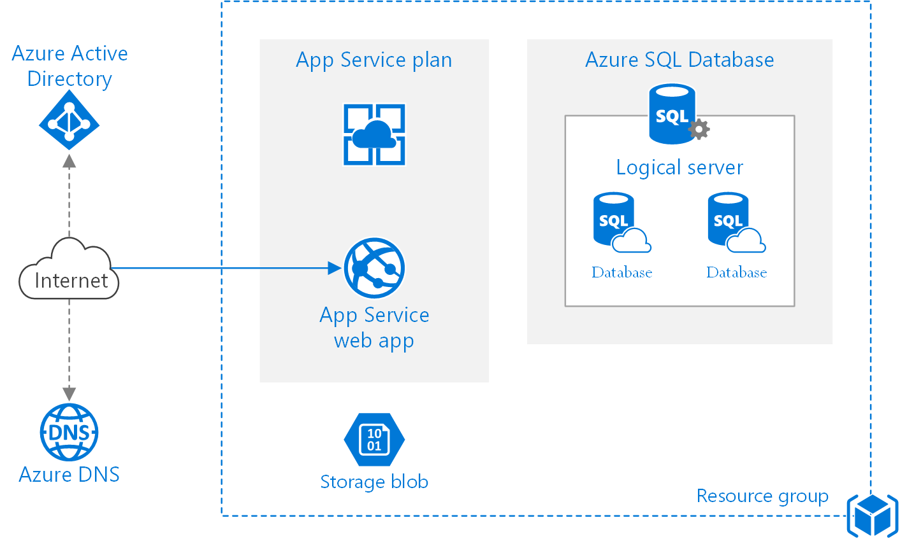

# Azure Basic PaaS Based Web Application

The Underlined architecture and its references are taken from [Azure Architecture Center.](https://docs.microsoft.com/en-us/azure/architecture/guide/) The microsoft site has all content and services details and deployment details outlined are available in ARM-template (json format). This article deploys the same architecture using hashicorp language (HCL) terraform. The code build is enterprise ready code in modularized structure.

By Changing the values in `terraform.tfvars` files you can deploy this architecture in N-number of environments you have in your organization. 

## **Summary**
The architecture shows proven practices for a web application that uses Azure App Service and Azure SQL Database. The architecture has other components like *Resource groups*, *App Service Plan & App*, *Deployment Slots*, *IP-Address*, *Azure DNS*, *Azure SQL Database*, *Logical Server*, *Azure Storage*, *Azure Active Directory* for more details on the each resources please click on this [link](https://docs.microsoft.com/en-us/azure/architecture/reference-architectures/app-service-web-app/basic-web-app#architecture)

  
  <h3 align="center">Reference Architecture of Basic Web Application </h3>

## **Information**

### **1. Module Structure**

* LICENSE
* README.md
* main.tf
* variables.tf
* outputs.tf  

Where each file details are outlined as; 

- **LICENSE** will contain the license under which the module is distributed. 
- **readme.md** will contain documentation describing how to use the module, in markdown format. 
- **main.tf** will contain the main set of configuration for the module.
- **variables.tf** will contain the variable definitions for the module. 
- **outputs.tf** Module outputs are made available to the configuration using the module, so they are often used to pass information about the parts of the  infrastructure defined in the module to other parts of current configuration.

### **2. Module Naming Convention**

| Terraform | Cloud-Provider | Function | Module Full-Name |
| --        | --             | --       | --               |
| terraform | azure | dns                   | tf-az-dns |
| terraform | azure | storage               | tf-az-strg|
| terraform | azure | app service plan      | tf-az-web | 
| terraform | azure | app service web app   | tf-az-web |
| terraform | azure | sql server            | tf-az-db  |
| terraform | azure | sql databases         | tf-az-db  |

### **3. Pre-requisites Executed**
- Resource group in azure account is created manually.
- Choice of region for deployment of azure resources is "Central India" 

### **4. Step By Step Terraform Code Creation Process**
1. Define terraform version and azure provider in `main.tf` file 
2. Define resource groups in `main.tf` file
3. Create files and update code in module folder named *tf-az-dns*
4. Define dns code in `main.tf`, `variables.tf` & `terraform.tfvars` file.
5. Create files and update code in module folder named *tf-az-strg*
6. Define dns code in `main.tf`, `variables.tf` & `terraform.tfvars` file. 
7. Create files and update code in module folder named *tf-az-db*
8. Define azure sql server and database code in `main.tf`, `variables.tf` & `terraform.tfvars` file.
7. Create files and update code in module folder named *tf-az-web*
8. Define azure app service plan and web app service code in `main.tf`, `variables.tf` & `terraform.tfvars` file.

### **5. Reference Details**
| Parameter | URL |  Terraformed Status   |
| --        | --  | --                    | 
| Azure Provider | [link](https://registry.terraform.io/providers/hashicorp/azurerm/latest/docs/guides/azure_cli) | Complete |
|Azure DNS|[link](https://registry.terraform.io/providers/hashicorp/azurerm/latest/docs/resources/dns_zone)|  Complete |
|Azure Web App| [link](https://registry.terraform.io/providers/hashicorp/azurerm/latest/docs/resources/app_service)|Complete |
|Azure Storage| [link](https://docs.microsoft.com/en-us/azure/storage/common/storage-introduction?toc=/azure/storage/blobs/toc.json)| Complete |
|Azure SQL Database| [link](https://docs.microsoft.com/en-us/azure/azure-sql/azure-sql-iaas-vs-paas-what-is-overview)|Complete |

